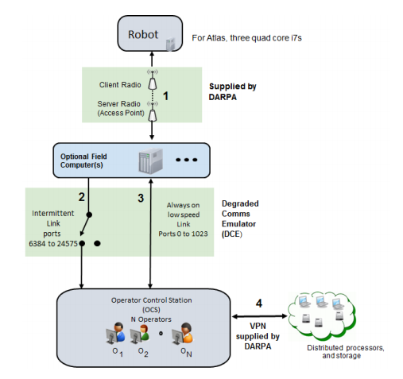
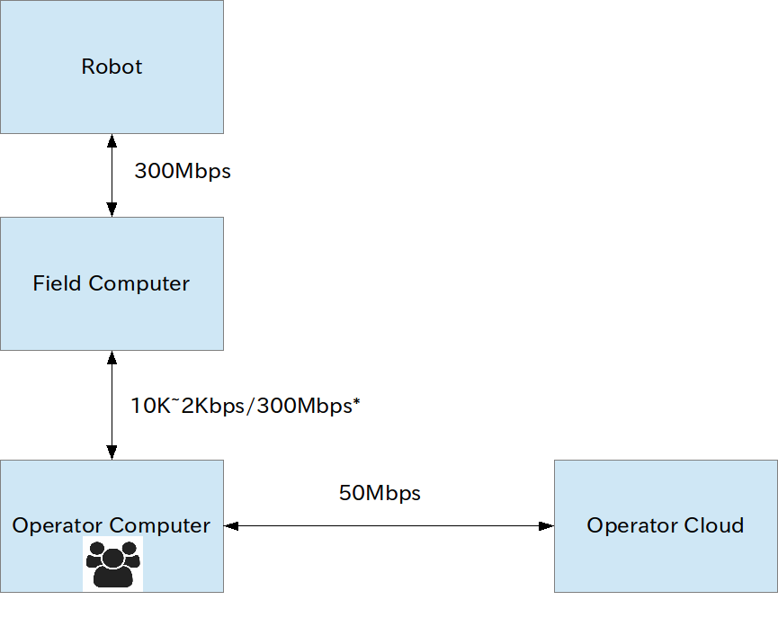
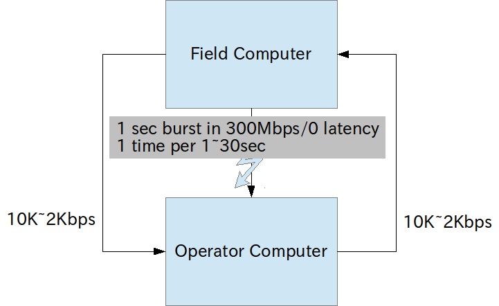
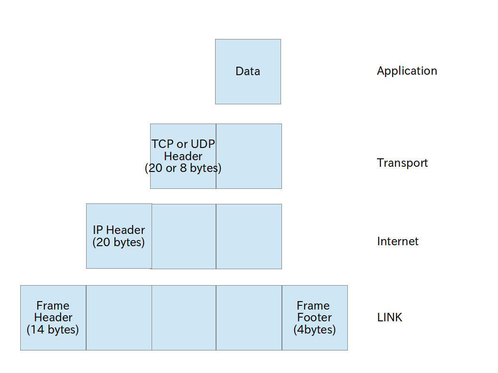
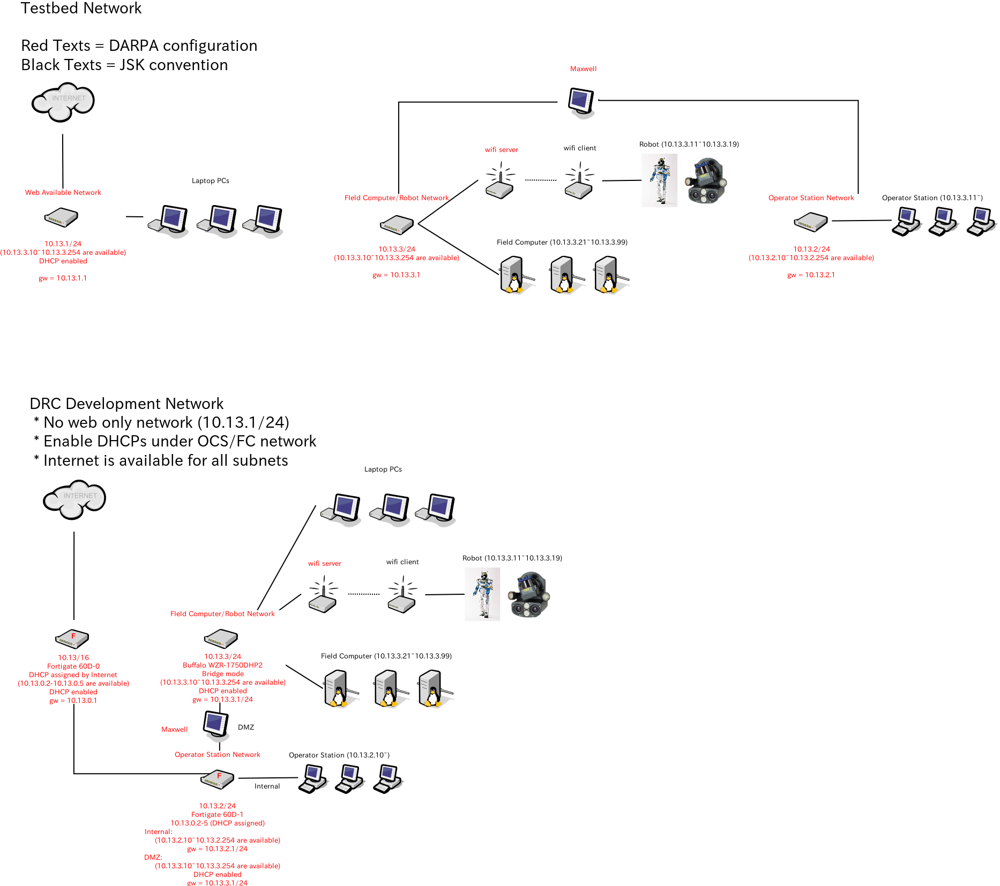

# DRCでのネットワークについて
本ドキュメントは[DRC Finals Rules](http://www.theroboticschallenge.org/sites/default/files/2014_12_3_Comms_Doc_For_Teams_DISTAR_Case_23912.pdf),
および[DRC Q&A](http://www.theroboticschallenge.org/files/2015_01_05_DRC_QA.pdf)に基づいたものである。



(This image is provided by darpa in [this document](http://www.theroboticschallenge.org/sites/default/files/2014_12_3_Comms_Doc_For_Teams_DISTAR_Case_23912.pdf))

## ルール概要


大きく分けて5つの領域に計算機を置くことが可能。その間の通信は制限される。
1. Robot
2. Field Computer
3. Operator Computor
4. Operator Cloud

特に2と3の間で提供される通信は特殊である。

* (0~1023 port) 常時2と3へ10kbpsから2kbpsの間の通信, 遅延なしの通信。
* (16384~24575 port) 3から4へ、1秒間の300Mbps, 遅延なしの通信。
ただしこれは300Mbitの"burst"通信が1秒から30秒の間で
ランダムに通信可能になる。

この２つはポートによって切り分けられる。また、ICMP(ping)は上の常時接続された
経路を通る.


# ネットワーク通信量
## プロトコル


### TCP/IP
TCP/IPはハンドシェイクが必要となるプロトコルである。
つまり計算機AからBへパケットPを通信したい時、AからBへパケットPを送るだけではなく、
BからACKと呼ばれる返答パケットが返ってこなくてはいけない。

この場合、通信遅延は双方向の和となる。

例えばAからBへの経路に遅延が1秒、BからAへの経路に遅延が1秒であった場合、遅延は2秒となる.

#### パケット構造
TCP/IPのヘッダは20byteである。さらにIP層も含めると、58byteとなる。
さらに8byteのパディングを入れることが多いため、実際のデータに加え66byteを利用すると考えて良い。

これはACKの最小サイズは66byteであると考えてよく、1秒間に1回データをやりとりするとして、
2000bit/secのレギュレーションの場合はおよそ1/4がACKで埋まるという事である。

### UDP
UDPはハンドシェイクを必要としない。ただし、信頼できる通信を実装するには、自分で
ACKのような確認パケットを送る仕組みを用意しなくてはいけない。

#### パケット構造
UDPのヘッダは8byteである。IP層も含めると36byteである。

### ROS
ROSのパケットは可変長データとしての最小の構成となる。

* [ROS Header](http://wiki.ros.org/ROS/Connection%20Header)

ヘッダの構成は`4-byte length + [4-byte field length + field=value ]*`となる.

簡単なメッセージは以下のようなサイズである.
1fieldのため、8 byteのオフセットがヘッダとして追加される。

---
    Message Type                | Data Size (bit)
--------------------------------|---------------
`std_msgs/Int32`                | 64
`std_msgs/Int64`                | 96
`std_msgs/String` (0 character) | 64
`std_msgs/String` (8 character) | 128
`std_msgs/Header` (empty frame) | 160

---
```python
In [14]: b = StringIO.StringIO()
In [15]: rospy.msg.serialize_message(b, 0, String())
In [16]: b.len
Out[16]: 8

In [18]: b = StringIO.StringIO()
In [19]: rospy.msg.serialize_message(b, 0, String(data='hogehoge'))
In [20]: b.len
Out[20]: 16

In [7]: b = StringIO.StringIO()
In [8]: rospy.msg.serialize_message(b, 0, Int32(data=10))
In [9]: b.len
Out[9]: 8

In [10]: b = StringIO.StringIO()
In [11]: rospy.msg.serialize_message(b, 0, Int64(data=10))
In [12]: b.len
Out[12]: 12
```

## 通信量の観点から
10kbpsは厳しい帯域制限である。

---
以下に各種データに関してそのサイズの大きさを示す。これらは理論値であり、実際に通信するときは
各パケットに対しヘッダが付与される。

* データ量比較

Data Type                      | Data Size(bit)     | Num per sec in 10kbps | Num per sec in 2kbps
-------------------------------|--------------------|-----------------------|---------------------
PointCloud (VGA)               |`640*480*3*4*8=28.8M`|                       |
Image (RGB,VGA)                | `640*480*3*8=7.2M` | 0.001                 | 0.0003
Image (RGB,QVGA)               | `320*240*3*8=1.8M` | 0.006                 | 0.001
Image (Mono,VGA)               | `640*480*1*8=2.4M` | 0.004                 | 0.0008
Image (Mono,QVGA)              | `320*240*1*8=0.6M` | 0.02                  | 0.003
Image (Mono,20x20)             | `20*20*8=0.4K`     | 3                     | 0.625
Image (Mono,10x10)             | `10*10*8=0.1K`     | 12                    | 2.5
Float                          | `32`               | 300                   | 62.5
Angle Vector (32 Float array)  | `1024`             | 9                     | 2
Bool                           | `1`                | 9600                  | 2000
Int                            | `64`               | 150                   | 31
OK-Warn-Error Status           | `2`                | 4800                  | 1000
Character                      | `8`                | 1200                  | 250

# 実験
## low speed network基礎実験
* 環境
  * `drc_2015_environment.py`を利用
    * 0~1023portを2000bpsに通信量を制限する
    * 16384~24575 portは1秒間の300Mbpsを1~30秒の間にランダムに一回。かつ一方通行
  * シンプルなソケットサーバーで実験
    * 一秒に一回データを送る
* 実験結果
  * TCP
    * コネクションが片側でしか張れない
      * しかもかなり時間がかかる
    * A->Bのみhigh speed networkが有効なときに
      * Aでserver, Bでclientは動く
      * Bでserver, Aでclientは動かない
  * UDP
    * 小さいサイズではうまく動く
      * うまく行ったデータ量(アプリケーションレイヤのデータサイズ)
        * 100 byte = 800 bit
        * 200 byte = 1600 bit
        * 240 byte = 1920 bit
        * 250 byte = 2000 bit
        * 300 byte = 2400 bit
        * 350 byte = 2800 bit
      * 遅延が生じ始めるデータ量
        * 370 byte = 2960 bit
        * 400 byte = 3200 bit
* 考察
  * TCPでコネクションを張れなかったのはwell-known port以外が一方通行だからか?
  * mini maxwellは小さいデータを制限するのがうまくない(windowのサイズにも寄りそう)
    * 2000bps制限なのに2500bpsくらい送れる
## high speed network基礎実験
* 環境
  * `drc_2015_environment.py`を利用
    * 0~1023portを9600bpsに通信量を制限する
    * 16384~24575 portは1秒間の300Mbpsを1~30秒の間にランダムに一回。かつ一方通行
  * シンプルなソケットサーバーで実験
    * 一秒に一回データを送る
* 実験結果
  * TCP
    * ネットワークが通じる間にしかconnectionがはれない
    * ネットワークがblackoutから復帰した瞬間にパケットが届く
    * (ある程度最近の)溜まっていた分が一気に届く
  * UDP
    * 動く
    * ネットワークがblackoutから復帰した瞬間にパケットが届く

## ROS実験
* 環境
  * `drc_2015_environment.py`を利用
    * 0~1023portを9600bpsに通信量を制限する
    * 16384~24575 portは1秒間の300Mbpsを1~30秒の間にランダムに一回。かつ一方通行
  * 何も考えずに`rostopic list`してみる
* 実験結果
  * timeoutする
* 考察
  * 何も考えないと11311ポートは閉じている
## ポートを考慮したROS実験
* 環境
  * `drc_2015_environment.py`を利用
    * 0~1023portを9600bpsに通信量を制限する
    * 16384~24575 portは1秒間の300Mbpsを1~30秒の間にランダムに一回。かつ一方通行
  * roscoreのポートを100にして、何も考えずに`rostopic list`してみる
* 実験結果
  * timeoutする
* 考察
  * ROSを直接利用するのは難しい
## rocon
* 環境
  * 全ポート2000bpsに制限. (redisのポートを変えるコストが高かったため)
  * roseus/test/talker.lでテスト。データは`hello world #i(1420697822 403252328)`のような文字列. 実行周期は1Hzに変更。
* 実験結果
  * 立ち上げ時から帯域制限
    * zeroconfが失敗してhubに繋げない
  * 接続確立後に帯域制限
    * 3-4回メッセージを送った後にbuffer bloatが発生。送信しているデータは文字列で288bit. ヘッダを含めても2000bitは行かない。
* 考察
  * 2000bpsではroconは無理。

# testbed
testbedでのネットワークを図にまとめた

## JSKでのtestbedネットワーク環境の再現
* 環境
  * fortigate60DのinternalとDMZポートを使い、それぞれOCSとFC/Robot用にDHCPを振ることでサブネットマスクを24のまま相互に通信する
  * fortigateの設定はconfigsディレクトリに保存してある。
  * DMZは1ポートしかないのでbuffaloの無線ルータをブリッジモードにして使用
  * fortigateのDMZポートとbuffaloの間にMaxwellをはさみ遅延環境を再現
* 実験結果
  * 有線で10.N.2.xと10.N.3.x間は934Mbps前後でている。
* 考察
  * 10.N.3.xのDHCPサーバがMaxwellを挟んでOCS側にあるため、遅延した時にFC/Robot側でDHCPを振ることができにくい。
