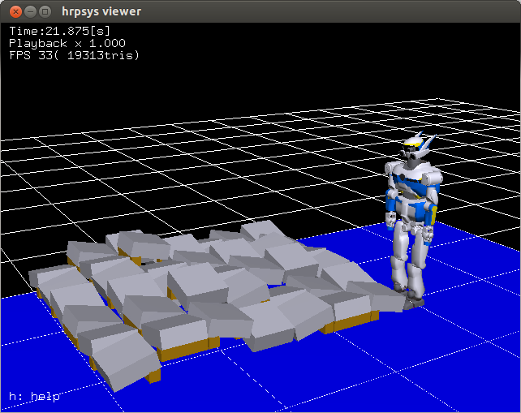
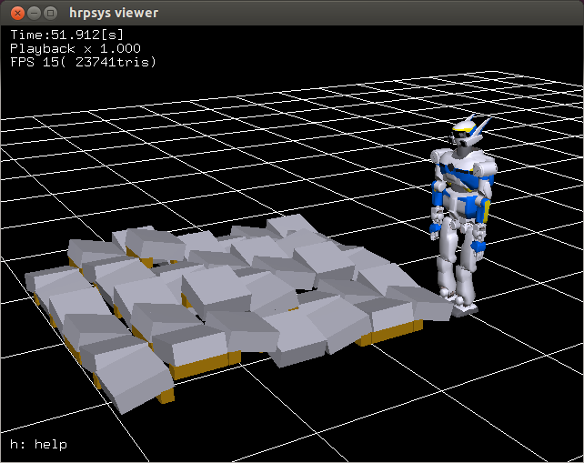
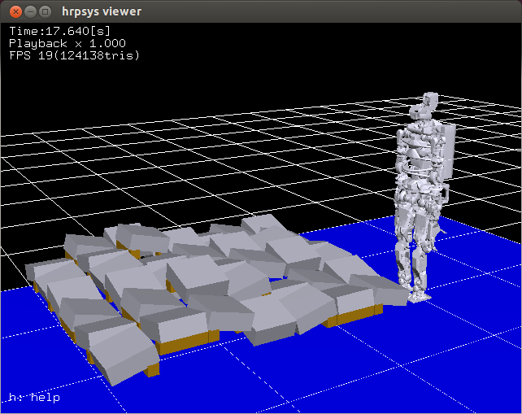
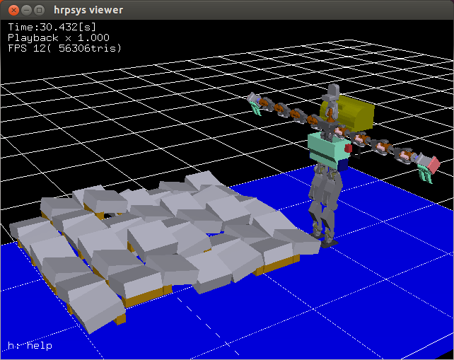
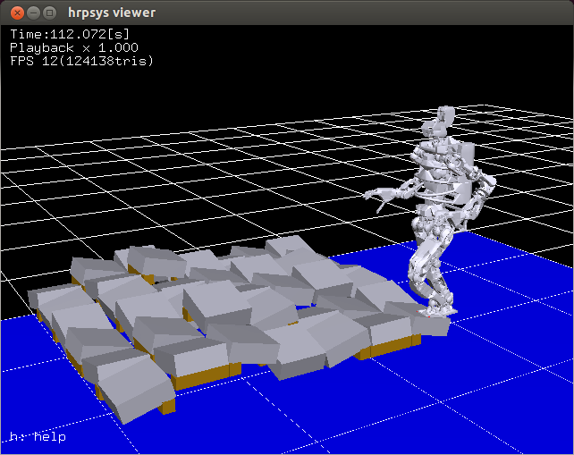
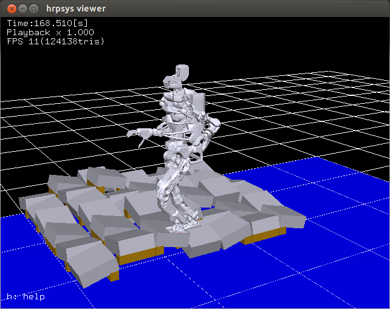

# drc_task_common

## Introduction
provides drc\_task\_ common task programs.

## Setup
1. Setup your account allowing sudo without password and keep environmental variable.

  It's required to use socket port 1-1023.

  Run following command
   ```
$ sudo visudo
```

  And add these lines:
  ```
  YOUR_ACCOUNT ALL=(ALL) NOPASSWD:ALL
  Defaults env_keep += "PYTHONPATH"
  Defaults env_keep += "ROS_PACKAGE_PATH"
  Defaults env_keep += "ROS_MASTER_URI"
  ```

  And restart your computer.

2. Set enviroment variable "ROBOT"
   For example,
   ```
   export ROBOT=HRP2JSKNT
   ```
   or
   ```
   export ROBOT=JAXON
   ```


## drc_task_common.launch

### DEVICE
this program needs
* 3D mouse (for move t-marker)
* B-Controll (for some bottuns)
* Track ball mouse (for move robot head)

### DEPEND
```
$ sudo aptitude install python-pygame
$ sudo pip install fysom
$ sudo aptitude install spacenavd ros-hydro-spacenav-node
$ sudo aptitude install python-urlgrabber
```

### How to launch
You should put two commands in the defferent terminal
```
roslaunch drc_task_common drc_task_common_hrp2jsknts.launch
roscd drc_task_common/config; rosrun rviz rviz -d drc_task_common.rviz
```

### Launch file components
drc\_task\_common is made up of 8 components,
preparing... Please read drc_task_common.launch


### How to Use B-Controll Interface
B-Controll provides 2x8 Buttons and 8 bars. This Section Introduces how to use buttons


for more details, please read source codes
https://github.com/jsk-ros-pkg/jsk_demos/blob/master/jsk_2015_06_hrp_drc/drc_task_common/scripts/b_control_client.py provides bottun interface

#### Upper, (1, 2, 3) From the Left,(Box, Cylinder, Torus) Button
Change Transformable Marker Type, for (Box, Cylinder, Torus) Like Objects.

#### Upper, 4 From the Left, SETPOS Button
Auto Move Robot Before T-Object Marker.(Maybe before 50cm from Objects, But Needs Some Changes)

#### Upper, 5 From the Left, GOPOS Button
Go Pos From Real Pos To Robot Marker Pos.
(Push U8 or D8 to Select)

#### Upper, 6 From the Left, Save Button
SAVE CURRENT OBJECT POSE(for moving object)

#### Upper, 7 From the Left, TOGGLE Button
Not Used

#### Lower, 1 From the Left, APPROACH Button
Change IK mode
* None (Simply solve IK with the coords)
* Reach (Solve IK to Reach object coords)
* Release (Solve IK to Release object)
current mode is displayed on rviz.


#### Lower, 2 From the Left, Mode Button
Change Marker Setting Mode,
* autoset (object will be set by click b-box)
* manuset (manual set object with 3d mouse)
* assoc (object will be assoced to robot hand coords)
current mode is displayed on rviz.

#### Lower, 3 From the Left, Menu Button
Launch Menu
* reverse (reverse object coords (z-axis will be reversed))
* chancel (close menu)

#### Lower, 4 From the Left, IK Button
solve IK with current robot pos and current t-object coords,
Robot model will be change pose with the result

#### Lower, 5 From the Left, Angle Button
send robot model's angle to real robot, You can change the velocity by changing the most right bar.

#### Lower, 6 From the Left, Menu Button
Launch Robot menu
* cancel
* switch irm (change ik arm)
* inverse-reachabily-map-mode
* reachability-map-mode
* reset pose (change robot model pose)
* reset pose (::)


### How to Use RVIZ Object User Interface
This is for manipulating other objects. Based on PointCloud Marker.
This also uses B-Control Interface for ANGLE and other Buttons.

#### Needed Rviz Object
preparing.... (may be in config/drc_task_common.rviz)

#### Flow
First, choose b-box in rviz.
Then, Interactive Cloud Marker will be made.
Click point in Cloud Marker, then One Circle(Menu Marker) will be made.
Right-Click it, then you can make other Marker, if you Right-Click this Marker, You can make robot solve ik.

#### Markers

##### Cloud Marker


You can move this with 6-Dof Control, you can select points of cloud for create menu marker

##### Menu Marker
show menu, this marker creates other markers.

##### Push Marker


show push point

##### Grasp Marke


show grasp point

##### Restraint Marker


show restraint, robot may solve ik with :x by this arrow.

#### Trouble shoot for this interface
Q. I can not select points !

A. We cannot select points over other Interactive marker, so please move Cloud Marker or delete other markers

Q. The IK Result is different from the result I thought.

A. This Interface provides two Base Frame, grasp commands and push command uses manipulate_frame and move command uses marker_frame. Before move commands done, robot thinks that The objects doesn't move. In other words, manipulate_frame does moves when move-object Event Driven.

### Trouble Shoot

Q. I can't move robot-head.

A. You should change mode for mouse, first, to know if mouse is connected
```
sudo hexdump mouse0
```
then, you should put command
```
sudo chmod 644 mouse0
```

Q. The following error occurred.
```
Traceback (most recent call last):
  File "/home/leus/ros/hydro/src/jsk-ros-pkg/jsk_control/jsk_teleop_joy/scripts/midi_config_player.py", line 97, in <module>
    main()
  File "/home/leus/ros/hydro/src/jsk-ros-pkg/jsk_control/jsk_teleop_joy/scripts/midi_config_player.py", line 63, in main
    controller = openMIDIInputByName(config["device_name"])
  File "/home/leus/ros/hydro/src/jsk-ros-pkg/jsk_control/jsk_teleop_joy/src/jsk_teleop_joy/midi_util.py", line 83, in openMIDIInputByName
    return openMIDIByName(device_name, 1)
  File "/home/leus/ros/hydro/src/jsk-ros-pkg/jsk_control/jsk_teleop_joy/src/jsk_teleop_joy/midi_util.py", line 97, in openMIDIByName
    raise MIDIException("Cannot find the device: %s" % (device_name))
```

A. MIDI controller （B-CONTROL) is not connected.

Q. The following error occurred.

```
Traceback (most recent call last):
  File "/home/leus/ros/hydro/src/jsk-ros-pkg/jsk_control/joy_mouse/scripts/mouse.py", line 20, in <module>
    rospy.get_param("~frame_id", "mouse"))
  File "/home/leus/ros/hydro/src/jsk-ros-pkg/jsk_control/joy_mouse/src/joy_mouse/joy.py", line 33, in main
    with open(device_name, "rb" ) as tp_file:
IOError: [Errno 13] Permission denied: '/dev/input/mouse0'
```

A. Track Ball is not connected.

Q. The following error occurred.

```
Traceback (most recent call last):
  File "/home/leus/ros/hydro/src/jsk-ros-pkg/jsk_control/jsk_teleop_joy/scripts/head_control_by_trackball.py", line 153, in <module>
    main()
  File "/home/leus/ros/hydro/src/jsk-ros-pkg/jsk_control/jsk_teleop_joy/scripts/head_control_by_trackball.py", line 148, in main
    controller.main()
  File "/home/leus/ros/hydro/src/jsk-ros-pkg/jsk_control/jsk_teleop_joy/scripts/head_control_by_trackball.py", line 132, in main
    self.enableHeadGroupControl()
  File "/home/leus/ros/hydro/src/jsk-ros-pkg/jsk_control/jsk_teleop_joy/scripts/head_control_by_trackball.py", line 83, in enableHeadGr
oupControl
    self.enable_head_joint_group_srv(gname='head', jnames=[self.pitch_joint_name, self.yaw_joint_name])
  File "/opt/ros/hydro/lib/python2.7/dist-packages/rospy/impl/tcpros_service.py", line 435, in __call__
    return self.call(*args, **kwds)
  File "/opt/ros/hydro/lib/python2.7/dist-packages/rospy/impl/tcpros_service.py", line 495, in call
    service_uri = self._get_service_uri(request)
  File "/opt/ros/hydro/lib/python2.7/dist-packages/rospy/impl/tcpros_service.py", line 463, in _get_service_uri
    raise ServiceException("service [%s] unavailable"%self.resolved_name)
rospy.service.ServiceException: service [/SequencePlayerServiceROSBridge/addJointGroup] unavailable
```

A. hrpsys_ros_bridge is not launched.

## test-drc-terrain-walk.l
This is kinematics (not dynamics) simulator of test terrain walk for DRC

### How to launch
You should generate xml file from wrl files, and launch the following for each robot

#### hrp2jsknt
```
rtmtest -t hrpsys_tools _gen_project.launch INPUT:=`rospack find hrp2_models`/HRP2JSKNT_for_OpenHRP3/HRP2JSKNTmain.wrl OUTPUT:=/tmp/HRP2JSKNT_for_DRCTestbedBlock.xml OBJECT_MODELS:="`rospack find hrpsys`/share/hrpsys/samples/environments/DRCTestbedTerrainJPBlock.wrl,0.4,-2.0,0,1,0,0,0, `rospack find openhrp3`/share/OpenHRP-3.1/sample/model/longfloor.wrl,0,0,0,1,0,0,0" CORBA_PORT:=15005 INTEGRATE:=false
rtmlaunch hrpsys_ros_bridge_tutorials hrp2jsknt.launch PROJECT_FILE:=/tmp/HRP2JSKNT_for_DRCTestbedBlock.xml
```



#### hrp2jsk
```
rtmtest -t hrpsys_tools _gen_project.launch INPUT:=`rospack find hrp2_models`/HRP2JSK_for_OpenHRP3/HRP2JSKmain.wrl OUTPUT:=/tmp/HRP2JSK_for_DRCTestbedBlock.xml OBJECT_MODELS:="`rospack find hrpsys`/share/hrpsys/samples/environments/DRCTestbedTerrainJPBlock.wrl,0.4,-2.0,0,1,0,0,0," CORBA_PORT:=15005 INTEGRATE:=false CONF_DT_OPTION:="--dt 0.004" SIMULATION_TIMESTEP_OPTION:="--timeStep 0.004"
rtmlaunch hrpsys_ros_bridge_tutorials hrp2jsk.launch PROJECT_FILE:=/tmp/HRP2JSK_for_DRCTestbedBlock.xml
```



#### jaxon
```
rtmtest -t hrpsys_tools _gen_project.launch INPUT:=${CVSDIR}/euslib/rbrain/jaxon/JAXONmain.wrl OUTPUT:=/tmp/JAXON_for_DRCTestbedBlock.xml OBJECT_MODELS:="`rospack find hrpsys`/share/hrpsys/samples/environments/DRCTestbedTerrainJPBlock.wrl,0.4,-2.0,0,1,0,0,0, `rospack find openhrp3`/share/OpenHRP-3.1/sample/model/longfloor.wrl,0,0,0,1,0,0,0" CORBA_PORT:=15005 CONF_DT_OPTION:="--dt 0.002" SIMULATION_TIMESTEP_OPTION:="--timeStep 0.002" INTEGRATE:=false
rtmlaunch hrpsys_ros_bridge_tutorials jaxon.launch PROJECT_FILE:=/tmp/JAXON_for_DRCTestbedBlock.xml
```



#### staro
```
rtmtest -t hrpsys_tools _gen_project.launch INPUT:=${CVSDIR}/euslib/rbrain/staro/STAROmain.wrl OUTPUT:=/tmp/STARO_for_DRCTestbedBlock.xml OBJECT_MODELS:="`rospack find hrpsys`/share/hrpsys/samples/environments/DRCTestbedTerrainJPBlock.wrl,0.4,-2.0,0,1,0,0,0, `rospack find openhrp3`/share/OpenHRP-3.1/sample/model/longfloor.wrl,0,0,0,1,0,0,0" CORBA_PORT:=15005 CONF_DT_OPTION:="--dt 0.002" SIMULATION_TIMESTEP_OPTION:="--timeStep 0.002" INTEGRATE:=false
rtmlaunch hrpsys_ros_bridge_tutorials staro.launch PROJECT_FILE:=/tmp/STARO_for_DRCTestbedBlock.xml
```



### Load euslisp
Load main euslisp program "test-drc-terrain-walk.l"

First,you should start roseus
```
roscd drc_task_common/euslisp
git pull origin master
roseus
```
And load "test-drc-terrain-walk.l"
```
(load "test-drc-terrain-walk.l")
```

### Try test-drc-terrain-walk simulation
Try terrain walking simulation for each robot (hrp2jsknt, hrp2jsk, jaxon, staro)

#### Setup pose
Load each robot interface.l and send walking-pose and command (objects (list *robot* *rleg-sole* *lleg-sole* *terrain*))
```
(setup-drc-testbed-terrain-simulation-hrp2jsknt)
(setup-drc-testbed-terrain-simulation-hrp2jsk)
(setup-drc-testbed-terrain-simulation-jaxon)
(setup-drc-testbed-terrain-simulation-staro)
```

#### Walk 1 step
One step terrain walk simulation for each robot by footstep

Footstep arguments are (rleg-fwd-offset[mm] lleg-fwd-offset[mm])
```
(test-drc-testbed-terrain-simulation-hrp2jsknt-one 280 280)
(test-drc-testbed-terrain-simulation-hrp2jsk-one 280 280)
(test-drc-testbed-terrain-simulation-jaxon-one 280 280)
(test-drc-testbed-terrain-simulation-staro-one 280 280)
```

For example, jaxon



#### Walk straight by some steps
One through terrain walk simulation by some steps for each robot by footstep
```
(test-drc-testbed-terrain-simulation-hrp2jsknt)
(test-drc-testbed-terrain-simulation-hrp2jsk)
(test-drc-testbed-terrain-simulation-jaxon)
(test-drc-testbed-terrain-simulation-staro)
```

For example, jaxon


