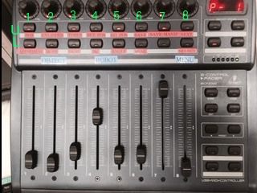
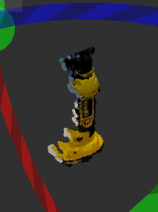
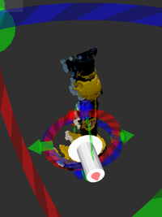
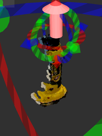

# drc_task_common

## Introduction
provides drc\_task\_ common interface

## drc_task_common.launch

### NEADS
this program needs 
* 3D mouse (for move t-marker)
* B-Controll (for some bottuns)
* some mouse (for move robot head)

### INSTALL
preparing...

### How to Use B-Controll Interface
B-Controll provides 2x8 Buttons and 8 bars. This Section Introduces how to use buttons

for more details, please read source codes 
https://github.com/jsk-ros-pkg/jsk_demos/blob/master/jsk_2015_06_hrp_drc/drc_task_common/scripts/b_control_client.py provides bottun interface

#### Upper, (1, 2, 3) From the Left,(Box, Cylinder, Torus) Button
Change Transformable Marker Type, for (Box, Cylinder, Torus) Like Objects.

#### Upper, 4 From the Left, SETPOS Button
Auto Move Robot Before T-Object Marker.(Maybe before 50cm from Objects, But Needs Some Changes)

#### Upper, 5 From the Left, GOPOS Button
Go Pos From Real Pos To Robot Marker Pos.
(Push U8 or D8 to Select)

#### Upper, 6 From the Left, Save Button
SAVE CURRENT OBJECT POSE(for moving object)

#### Upper, 7 From the Left, TOGGLE Button
Not Used

#### Lower, 2 From the Left, Mode Button
Change Marker Setting Mode, 
* autoset (object will be set by click b-box)
* manuset (manual set object with 3d mouse)
* assoc (object will be assoced to robot hand coords)
current mode is displayed on rviz.

#### Lower, 3 From the Left, Menu Button
Launch Menu 
* reverse (reverse object coords (z-axis will be reversed))
* chancel (close menu)

#### Lower, 4 From the Left, IK Button
solve IK with current robot pos and current t-object coords,
Robot model will be change pose with the result

#### Lower, 5 From the Left, Angle Button
send robot model's angle to real robot, You can change the velocity by changing the most right bar.

#### Lower, 6 From the Left, Menu Button
Launch Robot menu
* cancel
* switch irm (change ik arm)
* inverse-reachabily-map-mode
* reachability-map-mode
* reset pose (change robot model pose)
* reset pose (::)

### How to Use RVIZ Object User Interface
This is for manipulating other objects. Based on PointCloud Marker.
This also uses B-Control Interface for ANGLE and other Buttons.

#### Needed Rviz Object
preparing.... (may be in config/drc_task_common.rviz)

#### Flow
First, choose b-box in rviz.
Then, Interactive Cloud Marker will be made.
Click point in Cloud Marker, then One Circle(Menu Marker) will be made.
Right-Click it, then you can make other Marker, if you Right-Click this Marker, You can make robot solve ik.

#### Markers

##### Cloud Marker

You can move this with 6-Dof Control, you can select points of cloud for create menu marker

##### Menu Marker
show menu, this marker creates other markers.

##### Push Marker

show push point

##### Grasp Marke

show grasp point

##### Restraint Marker

show restraint, robot may solve ik with :x by this arrow.

#### Trable shoot for this interface
Q. I can not select points !

A. We cannot select points over other Interactive marker, so please move Cloud Marker or delete other markers

Q. The IK Result is different from the result I thought.

A. This Interface provides two Base Frame, grasp commands and push command uses manipulate_frame and move command uses marker_frame. Before move commands done, robot thinks that The objects doesn't move.

### Trouble Shoot
preparing...
