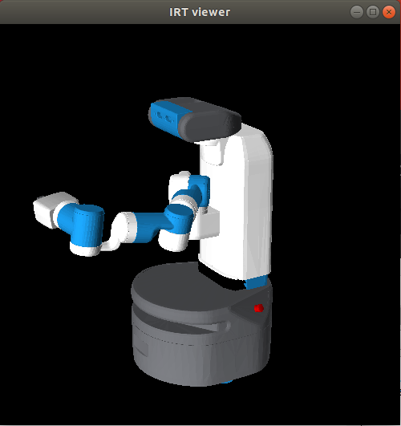
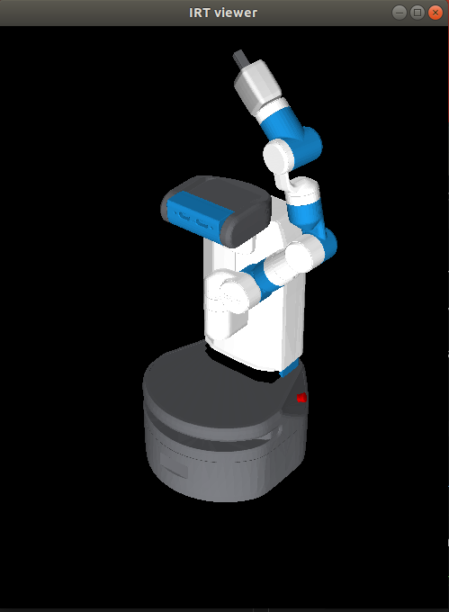
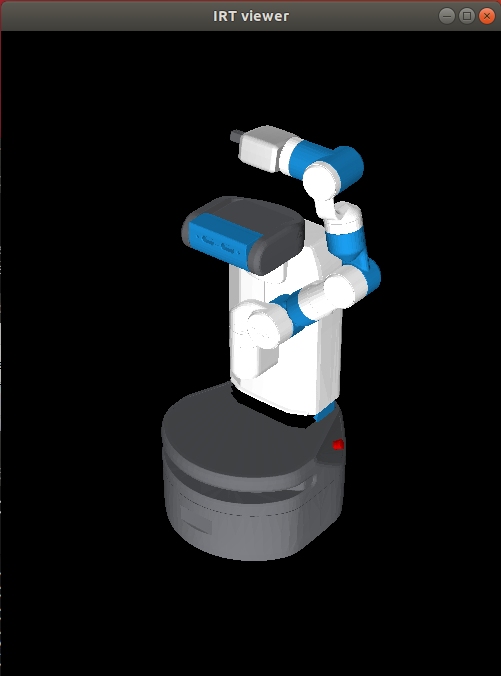

# jsk_2019_10_semi


## ロボットモデルの作り方

```
source /opt/ros/melodic/setup.bash
mkdir -p semi_ws/src
cd semi_ws/src
wstool init
wstool merge https://gist.githubusercontent.com/k-okada/db02de337e957d482ebb63c7a08a218b/raw/20b19f3ad92a8576510c0e0aa02bcd311b347beb/semi.rosinstall
wstool update
rosdep install --from-paths . --ignore-src -y -r
cd ..
catkin build -vi
source devel/setup.bash
```

とすると以下のプログラムでロボットのモデルを作ることが出来ます．

```
(load "package://peppereus/pepper.l")
(setq *pepper* (pepper))
(objects (list *pepper*))

(load "package://naoeus/nao.l")
(setq *nao* (NaoH25V50))
(objects (list *nao*))

(load "package://baxtereus/baxter.l")
(setq *baxter* (baxter))
(objects (list *baxter*))

(load "package://fetcheus/fetch.l")
(setq *fetch* (fetch))
(objects (list *fetch*))

(load "package://pr2eus/pr2.l")
(setq *pr2* (pr2))
(objects (list *pr2*))
```

## Coral TPU環境のセットアップのしかた

### Coral TPUのインストール を行う

https://github.com/knorth55/coral_usb_ros#install-the-edge-tpu-runtime をみてCoral TPUをインストールする

```
echo "deb https://packages.cloud.google.com/apt coral-edgetpu-stable main" | sudo tee /etc/apt/sources.list.d/coral-edgetpu.list
curl https://packages.cloud.google.com/apt/doc/apt-key.gpg | sudo apt-key add -
sudo apt-get update
sudo apt-get install libedgetpu1-max
sudo apt-get install python3-edgetpu
```

### Tensorflowliteのインストール を行う

https://github.com/knorth55/coral_usb_ros#install-just-the-tensorflow-lite-interpreter をみてtensorflowlite interpreterをインストールする
```
sudo apt-get install python3-pip
wget https://dl.google.com/coral/python/tflite_runtime-1.14.0-cp36-cp36m-linux_x86_64.whl
pip3 install tflite_runtime-1.14.0-cp36-cp36m-linux_x86_64.whl
```

### ワークスペースをビルドする

https://github.com/knorth55/coral_usb_ros#workspace-build-melodic
をみてワークスペースを作成しコンパイルする

```
source /opt/ros/melodic/setup.bash
mkdir -p ~/coral_ws/src
cd ~/coral_ws/src
git clone https://github.com/knorth55/coral_usb_ros.git
wstool init
wstool merge coral_usb_ros/fc.rosinstall.melodic
wstool update
rosdep install --from-paths . --ignore-src -y -r
cd ~/coral_ws
catkin init
catkin config -DPYTHON_EXECUTABLE=/usr/bin/python3 -DPYTHON_INCLUDE_DIR=/usr/include/python3.6m -DPYTHON_LIBRARY=/usr/lib/x86_64-linux-gnu/libpython3.6m.so
catkin build -vi
````````````````

### 学習済みモデルをダウンロードする

https://github.com/knorth55/coral_usb_ros#model-download をみてモデルをダウンロードする

```
source /opt/ros/melodic/setup.bash
source ~/coral_ws/devel/setup.bash
roscd coral_usb/scripts
python download_models.py
`````

## Coral TPUを試してみる

### USBカメラを立ち上げる

カメラノードを立ち上げる

```
source /opt/ros/melodic/setup.bash
rosrun usb_cam usb_cam_node
```

### Coralの認識ノードを立ち上げる

認識ノードを立ち上げる

```
source /opt/ros/melodic/setup.bash
source ~/coral_ws/devel/setup.bash
roslaunch coral_usb edgetpu_object_detector.launch INPUT_IMAGE:=/usb_cam/image_raw
```

### 結果を見てみる

表示ノードを立ち上げる

```
source /opt/ros/melodic/setup.bash
rosrun image_view image_view image:=/edgetpu_object_detector/output/image
```

## GitHubの使い方

例：new.lを作った時

初めにやること
```
source ~/semi_ws/devel/setup.bash
roscd jsk_2019_10_semi
```

ブランチを移動
```
git checkout add_jsk_2019_10_semi
```

大元の内容を自分のところにもってくる
```
git pull origin add_jsk_2019_10_semi
```

ブランチを作って移動 (ブランチが存在しない時は -bをつける)
```
git checkout (-b) new_branch
```

自分のGitを更新（addは初回のみ）
```
git add new.l
git commit -m "コメント" new.l
git push アカウント名 new_branch
```

最後に自分のGitのページを開いて自分のアカウントのnew_branchからk-okada/jsk-demosのadd_jsk_2019_10_semiブランチにPullreqを送る。

コンフリクトするとファイルにその情報が加わり、そのファイルを編集することで手動でコンフリクトを解消出来る。

マークダウン方式で.md方式でメモとかを作れる。詳しくは[ここ](https://gist.github.com/mignonstyle/083c9e1651d7734f84c99b8cf49d57fa
)にまとまっている。
atomだと[control] + [shift] + [M] キーでプレビュー出来る。

## ロボットシミュレーションの基本

### pepperを使った場合

* viewerのpepperを動かす：\*pepper*

* シミュレーターor実機を動かす：\*ri*

* roscoreを忘れずに！


どんなjointがあるのかを調べる
```lisp
(send *pepper* :methods :joint)
```

全てのパラメータを指定する
```lisp
(send *pepper* :angle-vector #f(...))
```

viewerのpepperの今の状態のパラメータを知る
```lisp
(send *pepper* :angle-vector)
```

上記のパラメータをシミュレーターに送る。
```lisp
(send *ri* :angle-vector (send *pepper* :angle-vector))
```

実機を動かす場合は何秒かけて行うかも指定
```lisp
(send *ri* :angle-vector (send *pepper* :angle-vector) 5000)
```

実機の今の状態のパラメータを知る
```lisp
(send *ri* :state :potentio-vector)
```

逆運動学
```lisp
 (send *pepper* :rarm :inverse-kinematics (make-coords :pos #f(1000 0 1000)) :revert-if-fail nil)
```

✱ revert-if-fail nil : 逆運動学に失敗しても解けたところまでで中断する。

## fetchを動かす

fetchについては以下を参照

[fetchの詳細](https://github.com/jsk-ros-pkg/jsk_robot/tree/master/jsk_fetch_robot)

fetchは腕とベースの干渉を計算してから動かす。 moveitに送って干渉計算をしてから動かしている。 （:angle-vector-raw　だとそれをしないで実行できる。） eusがインターフェースでそこからROSとかでロボットに送っている。

### 実機の接続する

まずは有線を繋いでwifiを切る
```
rossetip
rossetmaster fetch15
rostopic list
```
後はいつものように実行すれば良い

実機でポーズを作ってから角度取得できれば，実機と`roseus`が繋がっていることを確認できる．

```lisp
(send *ri* :state :potentio-vector)
```

### 実機を操作する

`roseus` 上でプログラムを実行

```lisp
(load "package://fetcheus/fetch-interface.l")
(fetch-init)
(objects (list *fetch*))
(send *ri* :state :potentio-vector) ;;現在の実機の状態を取得
(send *fetch* :angle-vector (send *ri* :state :potentio-vector)) ;;IRT viewerに適用
(send *ri* :speak-jp "日本語") ;;「日本語」と喋る
(send *ri* :go-pos 1 0 0) ;;xに1[m],yに0[m],z方向に0[degree]回る
(send *ri* :go-grasp :pos 0) ;;手の握りを0にする(完全に閉じる)
```

* fetchのポーズ一覧
fetch1
```
#f(5.52373 52.5326 3.4729 77.8638 -59.6255 10.2535 -78.2225 74.2234 0.022649 2.23)
```


fetch2
```
#f(5.56187 88.5458 -44.9768 -1.1279 -58.6368 -7.30264 -35.244 74.1355 0.294559 2.44973)
```


fetch3
```
#f(5.56952 88.5897 -42.0105 0.87161 -59.8672 3.90341 -76.157 7.51439 0.27191 2.42776)
```



* 喋らせる
```lisp
(send *ri* :speak-jp "こんにちは")
(send *ri* :speak-en "hello")
```

* 移動する
```lisp
(send *ri* :go-pos 1 0 0)
;;引数は x[m] y[m] z回転[degree]
```

* fetch用のRvizを立ち上げる
```
roscd jsk_fetch_startup
cd launch
roslaunch jsk_fetch_startup rviz.launch
```

### 色認識をする

hsi_color_filter.launchを使う
最初の arg nameをfetch用に少し変更した
```xml
<!-- hsi_color_filter 中身-->

<arg name="INPUT" default="points"/>
<arg name="CENTROID_FRAME" default="target"/>
<arg name="DEFAULT_NAMESPACE" default="hed_camera/depth_registered"/>
<arg name="FILTER_NAME_SUFFIX" default=""/>
<arg name="OUTPUT" default="hsi_output$(arg FILTER_NAME_SUFFIX)"/>
```

以下で実行する
```
roslaunch jsk_2019_10_semi hsi_color_filter.launch
```
/head_camera/depth_registered/boxesのトピックにバウンディングボックスがパブリッシュされる

### 干渉計算
Moveitにcollision-objectとしてpublishして干渉計算をしてもらう
```lisp
(load "package://pr2eus_moveit/euslisp/collision-object-publisher.l")

(setq *co* (instance collision-object-publisher :init))
(send *co* :add-object obj :frame_id link-name :relative-pose cds)

;;必要なくなったら消す
(send *co* :wipe-all)　;;:removeで指定したものだけ消すとかも出来る
```


## JSK豆知識

JSKのgithub上のパッケージは[jsk-ros-pkg](https://github.com/jsk-ros-pkg)にある。

画像認識とかの認識系は[jsk_recognitionのdocs
](https://jsk-recognition.readthedocs.io/en/latest/)を見ると良い。

## Emacs豆知識
C-x C-f : ファイル作成</br>
C-x 2 : 画面上下２分割</br>
C-x b \*shell*: shellをLispにする。</br>
C-x o : 画面移動</br>
# fetchを動かす for 2019_semi
### fetchに接続

```bash
$ rossetip
$ rossetmaster fetch15
$ source ~/semi_ws/devel/setup.bash
$ roslaunch jsk_fetch_startup rviz.launch #rvizを起動したいとき
```

### Rvizを用いた色認識
まず、授業で用いたturtlebotの hsi_color_filter.launch をfetchバージョンに書き換え、/jsk_2019_10_semi/launchに保存。<br>
```launch
<!-- hsi_color_filter.launch 変更箇所 -->
12  <arg name="INPUT" default="points"/>
13  <arg name="CENTROID_FRAME" default="target"/>
14  <arg name="DEFAULT_NAMESPACE" default="head_camera/depth_registered"/>
```
起動<br>
```bash
$ source ~/semi_ws/devel/setup.bash
$ roslaunch jsk_fetch_startup rviz.launch #rviz起動
$ roslaunch jsk_2019_10_semi hsi_color_filter.launch
$ rosrun rqt_reconfigure rqt_reconfigure #HSIのパラメータをいじりたい時
```
Rviz上で<br>
Add ▶ PointCloud2<br>
PointCloud2 ▶ Topic ▶ ~/hsi_output<br>
これで色付き点群を見ることができ、<br>
Add ▶ BoundingBoxArray<br>
で、認識した色の物体がBoxになっている様子を見ることができる。<br>

赤色を認識したい場合<br>
h_max=20, h_min=-20, s_max=255, s_min=80, i_max=255, i_min=50 くらいがちょうどよい。hsi_color_filter.launch のデフォルトに設定済み。

パラメータの一覧を取得
```bash
rostopic param
```
