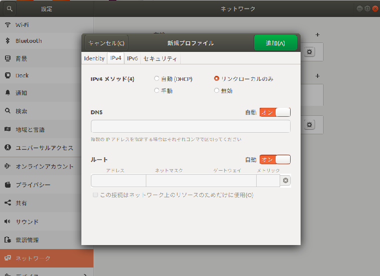
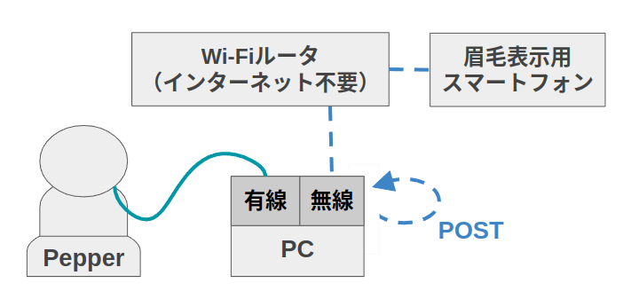

## Pepper（ペッパー）とこちさんのトークイベント

### 内容

台本に沿って、ロボットのペッパー（ニックネームはシナモン、ホップ）と人間のこちさんがこれまで取り組んできた博士論文の内容（ロボットによる人同士の交流づくり）を紹介する。

シナモンの時は、シナモンとこちさんが共有する思い出話を交えて対話する。

ホップの時は、ホップが聞き役となり、こちさんと研究内容に特化した対話をする。

どちらのペッパーも、眉毛で表情を表現する（シナモンの方が、表現の幅が広い）。

ペッパーの発話は、Scratchのボックスとして複数用意されている。

こちさんの発話に合わせて遠隔操縦者がボックスをクリックすることで、ペッパーとこちさんの自然な対話を実現した。

### 本ディレクトリの環境構築
1. クローンとビルド
    ```
    $ mkdir -p miraikan_ws/src
    $ cd miraikan_ws/src
    $ git clone https://github.com/jsk-ros-pkg/jsk_demos.git
    $ cd ~/miraikan_ws/src/jsk_demos/jsk_2022_08_miraikan_demo
    $ catkin bt
    $ source ~/miraikan_ws/devel/setup.bash
    ```

2. 眉毛デバイスのサーバーを立ち上げる場合には以下も行う<br>

    0. [公式サイト](https://docs.docker.com/engine/install/ubuntu/)を参照してdockerとdocker-composeをインストールしておく。sudoがなくてもdockerが立ち上がるよう、以下のコマンドを実行し、PCを再起動する<br>
        ```
        $ sudo groupadd docker
        $ sudo usermod -aG docker $USER
        ```

    1. Webサーバの環境構築
        ```
        $ source ~/miraikan_ws/devel/setup.bash
        $ roscd jsk_2022_08_miraikan_demo
        $ cd eyebrows_server
        $ docker-compose run --rm app /bin/bash
        # npx express-generator
        # npm install
        # exit
        $ docker-compose up
        ```
        http://localhost:3000 にアクセスしてHello Worldの画面が出ることを確認する

    2. 眉毛プログラムのDockerへのコピー
        ```
        $ sudo cp app/route/* src/routes/  # 本ディレクトリtypoしてるので注意
        $ sudo cp app/public/javascripts/* src/public/javascripts
        $ sudo cp app/views/* src/views
        $ sudo cp app/app.js src/app.js
        ```
        ```
        $ docker-compose up
        ```
        http://localhost:3000/rbrow, http://localhost:3000/lbrow にアクセスできればOK。Chromeブラウザ推奨。<br>
        ※Ubuntu16の場合は[docker-compose.yml](https://github.com/jsk-ros-pkg/jsk_demos/blob/master/jsk_2022_08_miraikan_demo/eyebrows_server/docker-compose.yml#L1)の`version`を`2`に変更する

### ペッパーとの接続・動作確認
0. Pepperのボタン操作<br>
    長押し（肩のLEDが点灯する、または音が鳴るまで）▷電源ON,OFF<br>
    2回押し▷レストモードON, OFF<br>
    1回押し▷IPアドレス確認<br>

1. Pepperとの接続：初回設定
    1. PepperとPCを有線接続し、設定からIPV4メソッドをリンクローカルのみに設定する。Pepperと名前を付けて設定を保存しておく。<br>
        <br>
    2. [pynaoqi-python2.7-2.5.5.5-linux64](https://drive.google.com/file/d/1xHuYREDa78xGiikEpsjxfZQ7Gfvo1E9D/view)をダウンロードし、.bashrcに以下を追記する
        ```
        export PYTHONPATH=$HOME/Downloads/pynaoqi-python2.7-2.5.5.5-linux64/lib/python2.7/site-packages:$PYTHONPATH
        ```
2. Pepperの起動と接続<br>
    ディスプレイ下の電源ボタンを長押しして起動。起動したらもう一度軽く押す。するとPepperが自分のIPアドレス`<Pepper_IP>`を音声で教えてくれる。また、`ifconfig`して有線ネットワークインターフェースの名前`<network interface name>`を確認する（例：`enp0s31f6`）。以下コマンドでPATHを通す。`.bashrc`に記述しても良い。
    ```
    $ export NAO_IP="<Pepper_IP>"
    $ export ROS_IP="<network interface name>"
    ```
3. `jsk_2022_08_miraikan_demo/scripts/disable_life.py`を使って、ペッパーのAutonomousLifeをオフにする。

    ```
    python disable_life --ip <Pepper_IP>
    ```

4. `jsk_2022_08_miraikan_demo/scripts/episode_motion.py`を実行してPepperが動いて喋ることを確認する<br>
    ```
    $ python
    >>> import episode_motion
    >>> talk = episode_motion.Talk("<Pepper_IP>")
    >>> talk.episode_11()
    ```

### Scratchの環境構築
1. npmのインストール（安易にaptでいれるとROSが消えるので注意する！！）
    ```
    $ sudo snap install node --channel=14/stable --classic
    $ npm --version
    # 6.14.17になることを確認する
    ```

2. scratch-rosの環境構築
    ```
    $ mkdir scratch
    $ cd scratch
    $ git clone https://github.com/Affonso-Gui/scratch3-ros-parser
    $ git clone -b jsk_robots https://github.com/Affonso-Gui/scratch3-ros-vm
    $ git clone -b jsk_robots https://github.com/Affonso-Gui/scratch3-ros-gui
    # 以下、時間がかかっても気長に待つこと
    $ cd scratch/scratch3-ros-vm && npm install
    $ cd ../scratch-ros-parser && npm install
    $ cd ../scratch-ros-gui && npm install
    $ cd ../scratch-ros-vm && sudo npm link
    $ cd ../scratch-ros-parser && sudo npm link
    $ cd ../scratch-ros-gui && sudo npm link
    $ npm link scratch-vm
    $ npm link scratch-parser
    $ npm start
    ```
    別ターミナルで
    ```
    $ roslaunch rosbridge_server rosbridge_websocket.launch
    ```
    http://0.0.0.0:8601/ にアクセスして、画面が立ち上がればOK

3. 本デモ用ボックスの追加<br>

    `scratch3-ros-vm/src/extensions/scratch3_pepperrobot/index.js`を[scratch/index.js](https://github.com/jsk-ros-pkg/jsk_demos/blob/master/jsk_2022_08_miraikan_demo/scratch/index.js)で書き換えてビルドする
    ```
    $ source ~/miraikan_ws/devel/setup.bash
    $ roscd jsk_2022_08_miraikan_demo
    $ cp scratch/index.js ~/scratch/scratch3-ros-vm/src/extensions/scratch3_pepperrobot/index.js
    $ cd ~/scratch/scratch-gui
    $ npm start
    ```
    別ターミナルで
    ```
    $ roslaunch rosbridge_server rosbridge_websocket.launch
    ```
    http://0.0.0.0:8601/ にアクセスして、左下ボタンからメニューページに飛び、Pepperを選択。Master URLを尋ねられるので`localhost`と打ち込む。

### 実行方法

#### 【デモの実行手順】

1. 以下の図のようにネットワーク接続を行う。<br>
    <br>

2. PCの設定からネットワーク▷有線▷Pepperを選択する。Pepperの電源を入れてIPアドレス`<Pepper_IP>`を聞き取ったら以下を実行する。また、`ifconfig`して有線ネットワークインターフェースの名前`<network interface name>`を確認する（例：`enp0s31f6`）。以下コマンドでPATHを通す。`.bashrc`に記述しても良い。
    ```
    $ export NAO_IP="<Pepper_IP>"
    $ export ROS_IP="<network interface name>"
    ```
    詳細は[ペッパーとの接続・動作確認](#ペッパーとの接続・動作確認)参照

3. `jsk_2022_08_miraikan_demo/scripts/disable_life.py`を使って、ペッパーのAutonomousLifeをオフにする。

    ```
    python disable_life --ip <Pepper_IP>
    ```

4. `jsk_2022_08_miraikan_demo/scripts/change_volume.py`で、随時ペッパーの音量を調整する。

    ```
    python change_volume.py --ip <Pepper_IP> --vol <volume>
    ```

5. ターミナルに`$ifconfig`と打ち込んだ時の`wlp1s0:`下の`inet`以降の値`<EServer_IP>`を確認する。スマートフォンを2台用意し、それぞれで左眉毛(http://<EServer_IP>:3000/lbrow)、右眉毛(http://<EServer_IP>:3000/rbrow)の画面を表示する。<br>
    ※ブラウザはGoogle Chrome推奨。ページが立ち上がったらアドレスバーを隠すよう、上にスワイプする。

6. scratchの立ち上げ（スクラッチを用いずに[rosservice](#rosservice)をターミナルから直接呼び出すこともできる）
    ```
    $ cd scratch/scratch-gui
    $ npm start
    ```
    ※[Scratchの環境構築](#Scratchの環境構築)が終わっている必要がある

7. launchファイルの立ち上げ
    ```
    $ source ~/miraikan_ws/devel/setup.bash
    $ roslaunch jsk_2022_08_miraikan_demo lecture-demo.launch pepper_ip:="<Pepper_IP>" run_eyebrows_server:=true memories_talk:=<true or false>
    ```
    http://0.0.0.0:8601/ にアクセスして、左下ボタンからメニューページに飛び、Pepperを選択。Master URLを尋ねられるので`localhost`と打ち込む。デモ用に追加したgreeting以下のボックスを押すと、Pepperと眉毛が動く

    ※`lecture-demo.launch`の引数詳細
    ```
    run_eyebrows_server: launchを立ち上げる際に眉毛デバイスサーバーを立ち上げるか否か
    eyebrows_server_ip: 眉毛デバイスのサーバーを立てているIPアドレス。眉毛デバイスのサーバーを別のPCで立てている場合は指定が必要。
    use_robot: 実機を繋いでいるか否か。繋いでいない場合は実機の動作の代わりにターミナルに経過秒数が表示される。
    pepper_ip: 実機のIPアドレス。use_robotがTrueの場合は指定が必要
    memories_talk: Trueの場合は思い出語りver, Falseの場合は発表形式verのデモが起動する。use_robotがFalseの場合には機能しない
    ```
8. 眉毛デバイスの取り付け（眉毛表情サーバを立ち上げている場合）<br>

    ターミナルに`$ifconfig`と打ち込んだ時の`wlp1s0:`下の`inet`以降の値`<EServer_IP>`を確認する。スマートフォンを2台用意し、それぞれで左眉毛(http://<EServer_IP>:3000/lbrow)、右眉毛(http://<EServer_IP>:3000/rbrow)の画面を表示する。<br>
    ※ブラウザはGoogle Chrome推奨。ページが立ち上がったらアドレスバーを隠すよう、上にスワイプする。


9. デモの実行

   こちさんの発話に合わせてスクラッチのボックスをクリックし，ROSのサービスコールを呼び出すことで，ペッパーに発話させる。<br>
   [発表時に用いたスライド（思い出語り有ver，研究室内部のみアクセス可能）](https://drive.google.com/file/d/1G7Z8F2-A9S_qwATh27KCqMO9ENFahSXu/view?usp=sharing)<br>
   [発表時に用いたスライド（思い出語り無ver，研究室内部のみアクセス可能）](https://drive.google.com/file/d/1fm9xKDxIA1S6sVjR47mSQkQ4DY2ZQEjA/view?usp=sharing)<br>
   [スクラッチのボックスのクリックの仕方が書かれた台本（研究室内部のみアクセス可能）](https://drive.google.com/file/d/1W3VTZFpUgeKUDFErIHt5hg3JlxO547oC/view?usp=sharing)

#### 【オフセット値調節】

デモを実行した際に以下の症状が出たらオフセット値を調節する。各実験日の朝に確認しておくこと。

1. 眉毛の左右の動きにずれが生じる

    用いているスマホによっては左右の眉毛の動きに時間差が生じる場合がある。その場合は[lbrow.jade](https://github.com/jsk-ros-pkg/jsk_demos/blob/master/jsk_2022_08_miraikan_demo/eyebrows_server/views/lbrow.jade#L14), [rbrow.jade](https://github.com/jsk-ros-pkg/jsk_demos/blob/master/jsk_2022_08_miraikan_demo/eyebrows_server/views/rbrow.jade#L14)の`delay_ms`を調節する。値を大きくするほど実行タイミングが遅くなる。<br>
    ファイルを変更したら
    ```
    web_nodejs$ sudo cp app/views/* src/views
    ```
    して変更を反映させること。src以下のファイルをsudoで直接いじっても良い。

2. Pepperの発話タイミングと眉毛の動きのタイミングにずれが生じる

    [robot-behavior-server.l](https://github.com/jsk-ros-pkg/jsk_demos/blob/master/jsk_2022_08_miraikan_demo/euslisp/robot-behavior-server.l#L8)の`TIME_OFFSET`の値を変更して調節を行う。値を大きくするほど眉毛の実行タイミングが遅くなる。

### rosservice
1. /demo_mode
    ```
    subscribe: mode       ... int32: 実行するデモ（動き・喋り・眉毛）のモード
             : time_delay ... int32: デモを開始して何秒後に眉毛を動かし始めるか
    publish  : success    ... bool : service callの呼び出しに成功したか否か 
    ```
2. /episode_introduction, /episode_0_1, ...
    ```
    Empty service
    ```

※コマンドから呼び出す例
```
$ rosservice call /episode_introduction
$ rosservice call /demo_mode "mode: 1 time_delay: 5"
```

### [旧]ペッパーの動き・言葉のデモとの組み合わせ
[fake_motion_talk.py](https://github.com/MiyabiTane/Deco_with_robot/blob/main/facial_expression/miraikan_demo/scripts/fake_motion_talk.py)を@a-ichikuraの[talk_motion.py](https://github.com/a-ichikura/miraikan/blob/master/pepper_talk/talk_motion.py)で置き換える。この時、talk_motion.pyの`if __name__ == '__main__':`以下はコメントアウトする。
```
if __name__ == '__main__':
    talk = Talk()
    talk.episode_11()
    talk.episode_12()
    talk.episode_13()
```

### [旧]Pepperのイベントプログラムへの組み込み
※以下、@kochigamiの[interactive_robot_demo](https://gitlab.jsk.imi.i.u-tokyo.ac.jp/kochigami/interactive_robot_demo/-/blob/master/lecture_demo)と組み合わせる場合を例として説明する

1. lecture-demo.launchに以下を追加する
    ```
    <arg name="eyebrows_server_ip" default="localhost" />
    <arg name="run_eyebrows_server" default="false" />
    <arg name="use_robot" default="true" />

    <include file="$(find miraikan_demo)/launch/demo.launch">
        <arg name="eyebrows_server_ip" value="$(arg eyebrows_server_ip)"/>
        <arg name="run_eyebrows_server" value="$(arg run_eyebrows_server)" />
        <arg name="use_robot" value="$(arg use_robot)" />
    </include>
    ```

2. 本ディレクトリのdemo.lの名前をrobot-behaior-server.lに変更し、もとあるものと置き換える